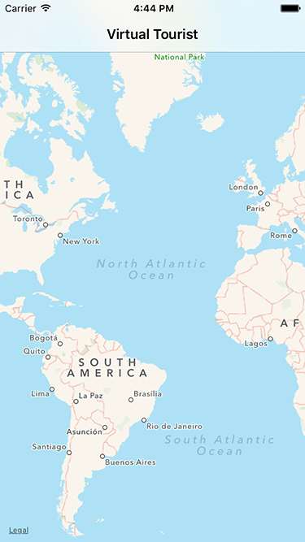
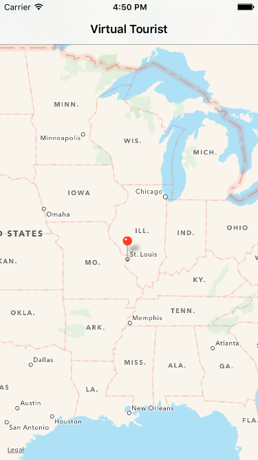
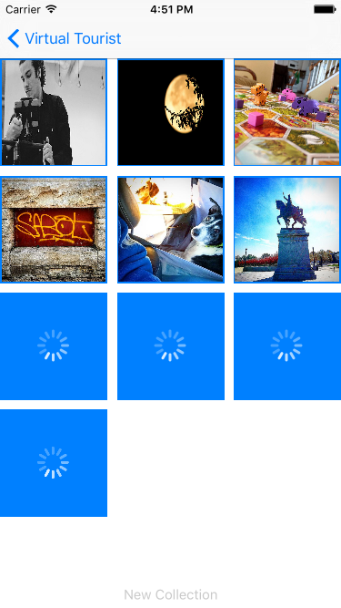
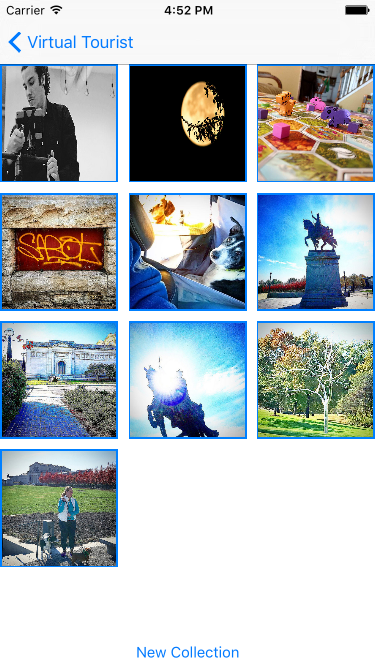

# Virtual-Tourist
UI Flow for app (iPhone 6 Simulator):

1) The app opens, displaying a map.

2) Zoom to an area where you'd like to place a pin, then long press the desired location.

3) Tapping the pin segues to the "album" view, where photos begin loading.

4) Up to 10 images will display upon download completion. Tap the New Collection button to replace the existing images with a new set.

Note: pins and up to 10 associated photos are persistently stored in Core Data. Requesting a New Collection replaces any existing photos in the underlying database with a new set of results from Flickr for the selected location.

The app currently doesn't have a delete function coded. If you desire to remove pins and photos to start with a clean slate:
- if using a simulator, click on Simulator/Reset Contents and Settings...
- if running on a device, delete the app from the device.

